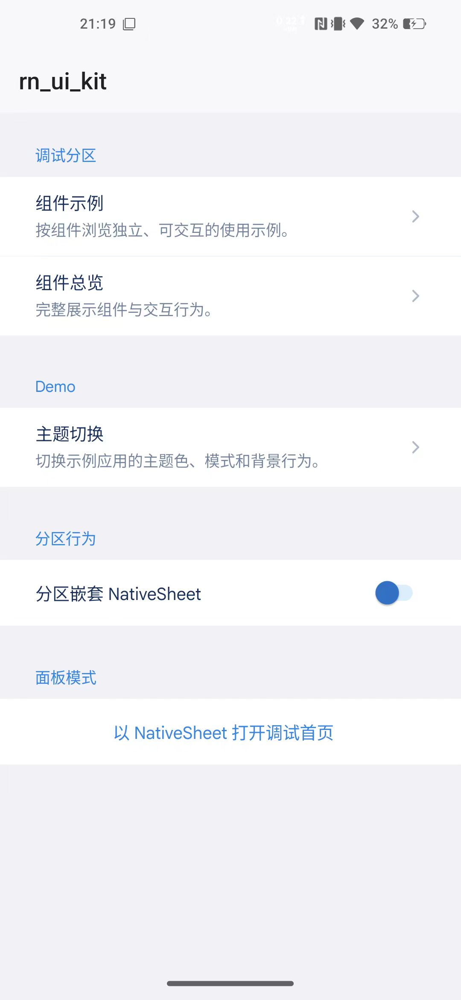
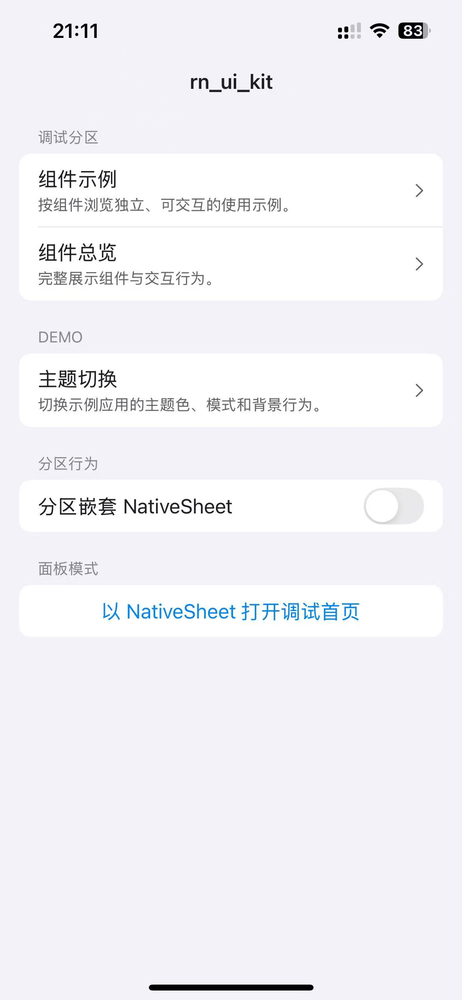
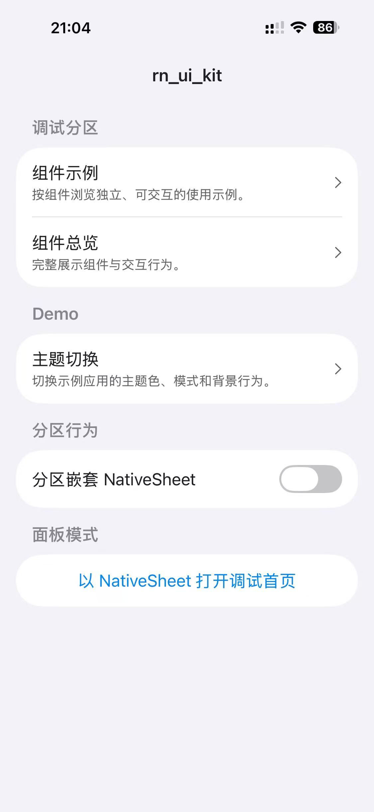

# rn-ui-kit

[中文](./README.md) · [English](./README_EN.md)

[Live demo (web)](https://rn-ui-kit.luoluoqixi.com/)

A cross-platform UI wrapper kit for Expo, React Native, and React Native Web.
Built on Tamagui, `rn-ui-kit` exposes a shared API over web implementations,
React Native implementations, and native platform capabilities. It also provides
theming, overlays, gestures, safe-area handling, toasts, and navigation helpers.


> [!WARNING]
> This library is currently used only in some of my own apps and is not intended
> to be a general-purpose UI library for everyone. Do not assume that its APIs,
> compatibility, or release process will suit other projects.

## Features

- A shared component API for iOS, Android, and Web
- Tamagui themes, tokens, responsive styles, and animations
- A `RootProvider` that wires up gestures, safe areas, sheets, toasts, themes,
  and native dialogs
- Light, dark, system, and custom accent theme support
- Native implementations or cross-platform fallbacks for menus, pickers, sheets,
  toasts, haptics, and more
- A component debug catalog and an Expo example app
- Bun patch synchronization for required upstream fixes
- Complete TypeScript type exports

## Runtime

The repository currently targets these major versions:

| Technology | Version |
| --- | --- |
| Expo | 55 |
| React Native | 0.83.9 |
| React / React DOM | 19.2.5 |
| Tamagui | 2.4.0 |
| TypeScript | 5.9.2 |
| Package manager | Bun |

`rn-ui-kit` is now a single package. Its default entry exports only core APIs,
while debug APIs are opt-in through `rn-ui-kit/debug`. Runtime frameworks and
native modules are declared in
[`packages/rn-ui-kit/package.json`](./packages/rn-ui-kit/package.json) under
`peerDependencies`. Use that file as the source of truth and keep Expo, React
Native, Tamagui, and native module versions compatible.

## Quick start

### Run the example app

```bash
bun install
bun run typecheck

# Start the Expo development server
bun --cwd examples/app start

# Or launch a specific platform
bun --cwd examples/app web
bun --cwd examples/app android
bun --cwd examples/app ios
```

The Android and iOS commands require their respective native development
toolchains. The Web example can run directly in a browser.

### Add the package to a workspace

This repository uses Bun workspaces. The example app only consumes the public
aggregate package through `workspace:*`:

```json
{
  "dependencies": {
    "rn-ui-kit": "workspace:*"
  }
}
```

### Add the package to an external app

Compiled standalone packages are stored in `rn-ui-kit-<version>` release
branches. These branches contain no workspace and do not require the consuming
app to compile TypeScript:

```bash
bun add github:luoluoqixi/rn-ui-kit#rn-ui-kit-<version>
```

For a private repository, use SSH:

```bash
bun add "git+ssh://git@github.com/luoluoqixi/rn-ui-kit.git#rn-ui-kit-<version>"
```

The consuming app must still satisfy the
[`peerDependencies`](./packages/rn-ui-kit/package.json) for Expo, React Native,
Tamagui, and the required native modules.

## Screenshots

| Android | iOS 18 | iOS 26 |
| :---: | :---: | :---: |
| <a href="./docs/SCREENSHOTS.md"></a> | <a href="./docs/SCREENSHOTS.md"></a> | <a href="./docs/SCREENSHOTS.md"></a> |

<p align="center">
  <a href="./docs/SCREENSHOTS.md">View the complete Android, iOS 18, and iOS 26 screenshot comparison</a>
</p>

## App setup

### 1. Initialize platform integrations

Load the initialization module before other UI imports in the app entry point:

```tsx
import "rn-ui-kit/initialize";
```

This initializes the Tamagui integrations for gestures, Zeego menus, native
toasts, gradients, keyboard control, Teleport portals, and Worklets.

### 2. Configure Tamagui

```tsx
// tamagui.config.ts
import { defaultConfig } from "@tamagui/config/v5";
import { animations } from "@tamagui/config/v5-css";
import { animations as animationsReanimated } from "@tamagui/config/v5-reanimated";
import { createTamagui, isWeb } from "tamagui";

import { themes } from "./themes";

const config = createTamagui({
  ...defaultConfig,
  animations: isWeb ? animations : animationsReanimated,
  themes,
});

export default config;

type AppConfig = typeof config;

declare module "tamagui" {
  interface TamaguiCustomConfig extends AppConfig {}
}
```

See the example
[`tamagui.config.ts`](./examples/app/tamagui.config.ts),
[`themes.ts`](./examples/app/themes.ts), and
[`tamagui.build.ts`](./examples/app/tamagui.build.ts) for a complete setup.

### 3. Add the root provider

```tsx
import "rn-ui-kit/initialize";

import { Button, RootProvider, Text } from "rn-ui-kit";
import { YStack } from "tamagui";

import config from "./tamagui.config";

export default function App() {
  return (
    <RootProvider
      tamaguiConfig={config}
      accentThemeName="ocean"
      accentThemeNames={["ocean", "sakura", "forest"]}
      preferences={{
        appearance: {
          accentColor: "ocean",
          backgroundFollowsTheme: false,
          themeMode: "system",
        },
      }}
    >
      <YStack flex={1} items="center" justify="center" gap="$4">
        <Text>Hello, rn-ui-kit</Text>
        <Button onPress={() => console.log("pressed")}>Get started</Button>
      </YStack>
    </RootProvider>
  );
}
```

`RootProvider` provides:

- `GestureHandlerRootView` and `SafeAreaProvider`
- The Tamagui theme context
- Sheet and portal support
- The toast viewport
- Native dialog and haptics contexts
- Color-scheme and accent-theme preferences

### 4. Configure Babel and Web styles

The example uses `babel-preset-expo`, `@tamagui/babel-plugin`, and
`react-native-worklets/plugin`. See
[`babel.config.js`](./examples/app/babel.config.js) for the complete
configuration.

After generating the Tamagui CSS for Web, import it from the app entry point:

```tsx
import "./tamagui.generated.css";
```

Generate it with:

```bash
bun --cwd examples/app generate:tamagui
```

## Usage

### Toast

```tsx
import { Button, useToast } from "rn-ui-kit";

export function SaveButton() {
  const { toast } = useToast();

  return (
    <Button
      onPress={() =>
        toast.success("Saved", {
          description: "The configuration was stored locally.",
        })
      }
    >
      Save
    </Button>
  );
}
```

### Dialog

```tsx
import { Button, Dialog, Text } from "rn-ui-kit";

export function ConfirmDialog() {
  return (
    <Dialog
      title="Delete this project?"
      description="This action cannot be undone."
      trigger={<Button>Open dialog</Button>}
      actions={
        <Dialog.Close asChild>
          <Button>Confirm</Button>
        </Dialog.Close>
      }
    >
      <Text>Confirm that you want to continue.</Text>
    </Dialog>
  );
}
```

### NativeList: native iOS lists

On iOS, `NativeList` uses the native `List` and `Section` components from
`@expo/ui/swift-ui` by default, with the system `insetGrouped` list style.
Navigation rows, selection indicators, switches, and selects use SwiftUI
controls where possible, naturally following system typography, colors,
feedback, and scrolling behavior.

```tsx
import { useState } from "react";
import {
  NativeList,
  NativeListNavigationItem,
  NativeListSection,
  NativeListSelectItem,
  NativeListSwitchItem,
} from "rn-ui-kit";

export function SettingsList() {
  const [autoSync, setAutoSync] = useState(true);
  const [themeMode, setThemeMode] = useState<string | null>("system");

  return (
    <NativeList>
      <NativeListSection title="Workspace" footer="Changes are saved automatically.">
        <NativeListNavigationItem
          title="Members"
          subtitle="Invitations, roles, and access"
          onPress={() => console.log("open members")}
        />
        <NativeListSwitchItem
          title="Automatic sync"
          switchProps={{
            checked: autoSync,
            onCheckedChange: setAutoSync,
          }}
        />
        <NativeListSelectItem
          title="Theme mode"
          selectProps={{
            value: themeMode ?? undefined,
            onValueChange: setThemeMode,
            options: [
              { label: "Light", value: "light" },
              { label: "Dark", value: "dark" },
              { label: "System", value: "system" },
            ],
          }}
        />
      </NativeListSection>
    </NativeList>
  );
}
```

Notes:

- Android and Web automatically use the cross-platform implementation built
  with `FlashList` and React Native views.
- Pass `<NativeList native={false}>` on iOS to opt into the same fallback
  appearance.
- Plain strings or numbers are recommended for a native row's `title`,
  `subtitle`, and `value`. Complex React nodes that cannot map directly to
  SwiftUI fall back to the cross-platform row implementation.
- `NativeListCustomItem` can host custom React Native content inside the native
  list.
- Use `initialScrollTarget` with a row's `nativeScrollId` for initial scroll
  positioning in the native iOS list.

See
[`collection_examples.tsx`](./packages/rn-ui-kit/src/debug/pages/component_examples/examples/collection_examples.tsx)
for a complete interactive example.

## Components

| Category | Components |
| --- | --- |
| Actions and feedback | `Button`, `Checkbox`, `Switch`, `ToggleGroup`, `Slider`, `Spinner`, `Progress`, `Toast`, `NativeDialog` |
| Forms | `Input`, `TextArea`, `Select`, `RadioGroup`, `Form`, `Label` |
| Layout and composition | `Accordion`, `Tabs`, `SplitView` / `SplitLayout`, `Card` |
| Overlays | `Dialog`, `AlertDialog`, `ContextMenu`, `Menu`, `Popover`, `Sheet` / `NativeSheet`, `Tooltip` |
| Lists and scrolling | `NativeList`, `ListGroup`, `ListItem`, `FlashList`, `ScrollView` |
| Display | `Avatar`, `Text`, `Image`, `Separator`, `Link` |
| Infrastructure | `RootProvider`, `UIProvider`, theme helpers, navigation helpers, portals, and platform utilities |

All public exports are listed in
[`packages/rn-ui-kit/src/core/components/ui/index.ts`](./packages/rn-ui-kit/src/core/components/ui/index.ts).
Each component directory also exports its prop types.

## Patch synchronization

The kit relies on a small set of upstream patches. After installing app
dependencies, run:

```bash
bun run sync-patches
```

Add the corresponding app script:

```json
{
  "scripts": {
    "sync-patches": "rn-ui-sync-patches"
  }
}
```

The command copies the kit patches into the app's `patches/` directory and
registers them in `package.json` under `patchedDependencies`. If the app needs
to keep its own patch for a dependency, exclude the matching kit patch:

```json
{
  "rnUiKitSyncPatches": {
    "exclude": ["@expo/cli@55.0.32"]
  }
}
```

Excluded dependencies are neither copied nor registered.

## Repository structure

```text
rn-ui-kit/
├─ packages/
│  └─ rn-ui-kit/          # The single public package
│     ├─ src/
│     │  ├─ core/         # Components, providers, themes, and platform adapters
│     │  ├─ debug/        # Component catalog, debug pages, and examples
│     │  ├─ index.ts      # Default entry; exports core only
│     │  ├─ debug.ts      # rn-ui-kit/debug subpath
│     │  └─ initialize.ts # rn-ui-kit/initialize subpath
│     ├─ patches/         # Upstream patches synchronized into consuming apps
│     └─ scripts/         # rn-ui-sync-patches
├─ examples/
│  └─ app/                # Expo app for iOS, Android, and Web
├─ scripts/
│  ├─ set-version.js      # Synchronizes the project version
│  ├─ package-release.js  # Creates compiled release branches
│  └─ package-release.md  # Detailed release documentation
├─ package.json           # Bun workspace, build, and release commands
└─ bun.lock
```

## Development

```bash
# Compile rn-ui-kit into packages/rn-ui-kit/dist
bun run build

# Type-check the package and example app
bun run typecheck

# Type-check rn-ui-kit only
bun --cwd packages/rn-ui-kit typecheck

# Type-check the example app
bun --cwd examples/app typecheck
```

When adding or changing a component, consider adding a matching entry to the
`packages/rn-ui-kit/src/debug` component catalog so its behavior and visuals
can be checked on iOS, Android, and Web.

## Build and release

```bash
# Update versions and synchronize bun.lock
bun run set-version 1.0.1

# Generate only the release directory and tarball
bun run package-release --pack-only

# Generate the release directory, tarball, and local rn-ui-kit-1.0.1 branch
bun run package-release

# Push the release branch after verifying it
git push -u origin rn-ui-kit-1.0.1
```

The release build compiles the single `packages/rn-ui-kit` package directly; it
does not merge packages dynamically. A release branch contains only compiled
`dist` output, package.json, README, LICENSE, patches, and runtime scripts. See
[`scripts/package-release.md`](./scripts/package-release.md) for the complete
release process.

## License

[MIT](./packages/rn-ui-kit/LICENSE) © 2026 luoluoqixi
